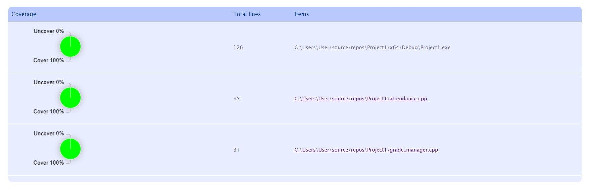

# Attendance Management System

## D1-D5 적용 여부 체크리스트

| 항목 | 적용 여부 | 설명 |
|:------:|:----------:|------|
| D1 | O | 가독성 있는 코드로 메서드 추상화, 가독성 좋은 네이밍 사용 |
| D2 | O | Regression Test를 위한 Unit Test 개발 |
| D3 | O | 확장성을 고려한 설계 (Grade Manager Class 생성) |
| D4 | O | 디자인 패턴 사용하기 (Grade Manager에 Factory Pattern 적용) |
| D5 | O | 코드 커버리지 100% |

## Code Coverage 최종 측정 결과

